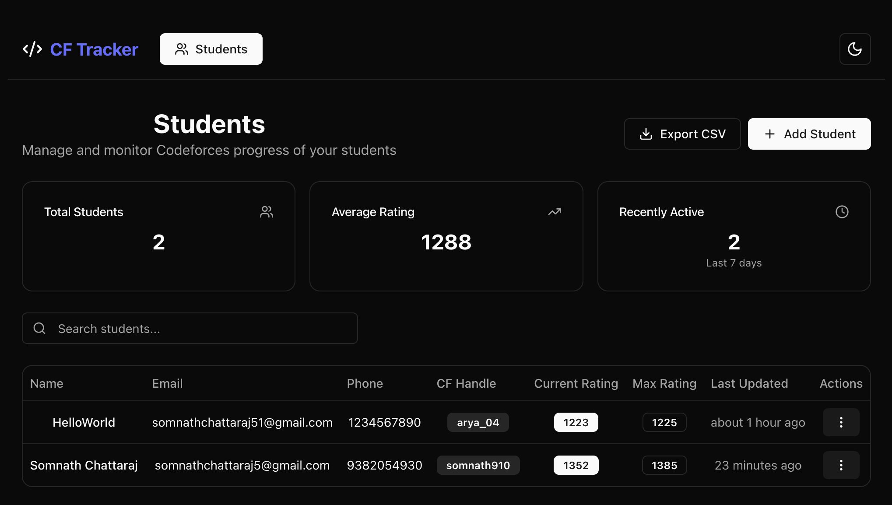

# Codeforces Student Tracker

A full-stack MERN application designed to help instructors manage and monitor the Codeforces competitive programming progress of their students. The application provides comprehensive analytics, automated data synchronization, and email notifications to keep track of student activity and performance.


## 🎥 Video Walkthrough

Watch a quick demo of how the Codeforces Student Tracker works:

[](https://youtu.be/lQNTkC__SnQ)


---


## 🌟 Features

### 📊 Student Management Dashboard
- **Responsive Student Table**: View all students with their current ratings, contact information, and last activity
- **Advanced Search & Filtering**: Quickly find students by name, email, or Codeforces handle
- **Bulk Operations**: Export student data to CSV format
- **Real-time Statistics**: Track total students, average ratings, and recent activity

### 👤 Detailed Student Profiles
- **Contest History Analysis**: 
  - Interactive rating progression charts
  - Contest performance tables with ranking and rating changes
  - Customizable time filters (30/90/365 days)
  
- **Problem Solving Analytics**:
  - Most difficult problems solved
  - Average problem ratings and daily solving rates
  - Problem distribution by difficulty rating
  - Visual charts and statistics

- **Activity Monitoring**:
  - GitHub-style submission heatmaps
  - Activity tracking across different time periods
  - Last submission timestamps

### 🔄 Automated Data Synchronization
- **Daily Cron Jobs**: Automatic Codeforces data sync at 2 AM
- **Manual Sync Options**: Force refresh individual student data
- **Rate Limiting**: Respects Codeforces API limits with built-in delays
- **Error Handling**: Robust error handling for API failures

### 📧 Smart Notifications
- **Inactivity Detection**: Automatically identifies students with no recent submissions
- **Email Reminders**: Sends motivational emails to inactive students
- **Configurable Settings**: Toggle notifications per student
- **Tracking**: Monitor number of reminders sent

### 🎨 Modern UI/UX
- **Dark/Light Theme**: System-aware theme switching
- **Responsive Design**: Works seamlessly on desktop, tablet, and mobile
- **ShadCN UI Components**: Modern, accessible component library
- **Interactive Charts**: Beautiful data visualizations with Recharts

## 🛠️ Tech Stack

### Frontend
- **React 18** with TypeScript
- **Vite** for fast development and building
- **Tailwind CSS** for styling
- **ShadCN UI** for component library
- **React Router** for navigation
- **Recharts** for data visualization
- **React Calendar Heatmap** for activity visualization

### Backend
- **Node.js** with Express.js
- **MongoDB** with Mongoose ODM
- **Node-cron** for scheduled tasks
- **Nodemailer** for email functionality
- **Axios** for HTTP requests
- **Helmet** for security
- **Express Rate Limit** for API protection

## 🚀 Quick Start

### Prerequisites
- Node.js 18+ installed
- MongoDB running locally or MongoDB Atlas account
- Gmail account for SMTP (or other email provider)

### Installation

1. **Clone the repository**
   ```bash
   git clone https://github.com/Somnath-Chattaraj/Project
   cd codeforces-student-tracker
   ```

2. **Install dependencies**
   ```bash
   npm install
   ```

3. **Environment Setup**
   
   Copy the example environment file:
   ```bash
   cp .env.example .env
   ```
   
   Update the `.env` file with your configuration:
   ```env
   # Server Configuration
   PORT=3000
   NODE_ENV=development
   FRONTEND_URL=http://localhost:5173

   # Database
   MONGODB_URI=mongodb://localhost:27017/codeforces-tracker

   # Email Configuration
   SMTP_HOST=smtp.gmail.com
   SMTP_PORT=587
   SMTP_USER=your-email@gmail.com
   SMTP_PASS=your-app-password

   # Cron Job Configuration
   SYNC_CRON_SCHEDULE=0 2 * * *
   ```

4. **Start the application**
   ```bash
   npm run dev
   ```

   This will start both the frontend (http://localhost:5173) and backend (http://localhost:3000) concurrently.

## 📁 Project Structure

```
codeforces-student-tracker/
├── src/                          # Frontend React application
│   ├── components/               # Reusable UI components
│   │   ├── ui/                  # ShadCN UI components
│   │   ├── ContestTable.tsx     # Contest history table
│   │   ├── ProblemStatsChart.tsx # Problem statistics chart
│   │   ├── RatingChart.tsx      # Rating progression chart
│   │   ├── StudentForm.tsx      # Student add/edit form
│   │   └── SubmissionHeatmap.tsx # Activity heatmap
│   ├── contexts/                # React contexts
│   ├── hooks/                   # Custom React hooks
│   ├── pages/                   # Page components
│   ├── services/                # API service functions
│   ├── types/                   # TypeScript type definitions
│   └── lib/                     # Utility functions
├── server/                       # Backend Node.js application
│   ├── models/                  # MongoDB schemas
│   │   ├── Student.js           # Student data model
│   │   ├── Contest.js           # Contest data model
│   │   └── Submission.js        # Submission data model
│   ├── routes/                  # Express route handlers
│   │   ├── students.js          # Student CRUD operations
│   │   ├── contests.js          # Contest data endpoints
│   │   └── submissions.js       # Submission data endpoints
│   ├── services/                # Business logic services
│   │   ├── codeforcesService.js # Codeforces API integration
│   │   ├── emailService.js      # Email notification service
│   │   └── csvService.js        # CSV export functionality
│   └── index.js                 # Server entry point
└── package.json                 # Project dependencies and scripts
```

## 🔧 Configuration

### Cron Job Configuration
The `SYNC_CRON_SCHEDULE` uses standard cron syntax:
- `0 2 * * *` - Daily at 2:00 AM
- `0 */6 * * *` - Every 6 hours
- `0 0 * * 0` - Weekly on Sunday at midnight

## 📚 API Documentation

### Students Endpoints
- `GET /api/students` - Get all students
- `GET /api/students/:id` - Get student by ID
- `POST /api/students` - Create new student
- `PUT /api/students/:id` - Update student
- `DELETE /api/students/:id` - Delete student
- `POST /api/students/:id/sync` - Sync student data from Codeforces
- `GET /api/students/csv/export` - Export students to CSV

### Contests Endpoints
- `GET /api/contests/:handle` - Get contest history for a handle
  - Query params: `days` (default: 365)

### Submissions Endpoints
- `GET /api/submissions/:handle` - Get submissions for a handle
  - Query params: `days` (default: 90)
- `GET /api/submissions/:handle/stats` - Get problem solving statistics
  - Query params: `days` (default: 30)
- `GET /api/submissions/:handle/heatmap` - Get submission heatmap data
  - Query params: `year` (default: current year)

## 🔒 Security Features

- **Helmet.js**: Security headers
- **Rate Limiting**: API request throttling
- **Input Validation**: Mongoose schema validation
- **CORS**: Configured for frontend domain
- **Environment Variables**: Sensitive data protection

## 📊 Monitoring & Analytics

### Student Performance Metrics
- Current and maximum Codeforces ratings
- Contest participation and ranking trends
- Problem solving patterns and difficulty progression
- Activity consistency tracking

### System Health
- API response times and error rates
- Database connection status
- Email delivery success rates
- Cron job execution logs

## 🚀 Deployment

### Frontend (Vercel)
1. Connect your GitHub repository to Vercel
2. Set build command: `npm run build`
3. Set output directory: `dist`
4. Deploy automatically on push

### Backend (Render)
1. Connect your GitHub repository
2. Set start command: `npm run server`
3. Configure environment variables
4. Deploy with automatic builds

### Database (MongoDB Atlas)
1. Create a cluster on MongoDB Atlas
2. Configure network access and database users
3. Update `MONGODB_URI` in production environment

## 🤝 Contributing

1. Fork the repository
2. Create a feature branch: `git checkout -b feature/amazing-feature`
3. Commit your changes: `git commit -m 'Add amazing feature'`
4. Push to the branch: `git push origin feature/amazing-feature`
5. Open a Pull Request

## 📝 License

This project is licensed under the MIT License

---

**Happy Coding! 🎯**
